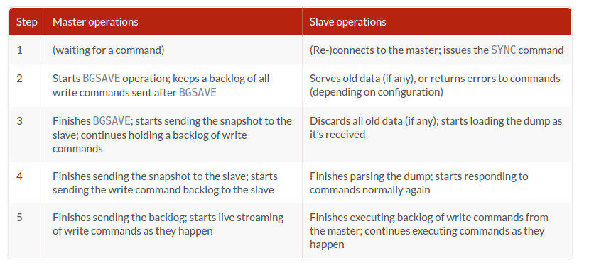

## Redis.
Its pretty cool the breadth of scenarios Redis is being used for.

> This post is part of the series on [Getting Started and Beyond](https://github.com/abgoswam/getting-started-and-beyond)

- [What is Redis ?](#what-is-redis-)
- [Internals](#internals)
	- [Persistence](#persistence)
	- [Replication](#replication)
		- [Redis replication startup process](#redis-replication-startup-process)
		- [Replacing a failed master](#replacing-a-failed-master)
	- [Publish / Subscribe.](#publish-subscribe)
	- [Transactions (and thereby Pipelines)](#transactions-and-thereby-pipelines)
		- [DELAYED EXECUTION WITH MULTI/EXEC CAN IMPROVE PERFORMANCE](#delayed-execution-with-multiexec-can-improve-performance)
		- [Errors inside a transaction](#errors-inside-a-transaction)
	- [Source Code Layout](#source-code-layout)
		- [server.h](#serverh)
		- [server.c](#serverc)
		- [networking.c](#networkingc)
		- [aof.c and rdb.c](#aofc-and-rdbc)
	- [Master-Slave in Redis Clusters](#master-slave-in-redis-clusters)
	- [Anatomy of Redis startup.](#anatomy-of-redis-startup)
	- [Anatomy of a Redis command](#anatomy-of-a-redis-command)

## What is Redis ?
- a _Data Structures Server_
    - What this means is that Redis provides access to mutable data structures via a set of commands, which are sent using a server-client model with TCP sockets and a simple protocol. So different processes can query and modify the same data structures in a shared way.
- Data structures implemented into Redis have a few special properties:
    - Redis cares to store them on disk, even if they are always served and modified into the server memory. This means that Redis is fast, but that is also non-volatile.
    - Implementation of data structures stress on memory efficiency, so data structures inside Redis will likely use less memory compared to the same data structure modeled using an high level programming language.
    - Redis offers a number of features that are natural to find in a database, like replication, tunable levels of durability, cluster, high availability.

## Internals

### Persistence
- Persistence allows data in-memory to be persisted to disk
- There are two different ways of persisting data to disk:
    - Snapshotting
        - take data as it exists at one moment and write it to disk
    - AOF (Append Only File)
        - copy incoming write commands to disk as they happen
    - these methods can be used together, separately, or not at all in some circumstances.

### Replication
- Keep up-to-date copies of your data on additional machines for both performance and data reliability.
- Replication is a method by which other servers receive a continuously updated copy of the data as it’s being written, so that the replicas can service read queries
- For situations where we need to scale out read queries we can set up additional slave Redis servers to keep copies of our dataset. After receiving an initial copy of the data from the master, slaves are kept up to date in real time as clients write data to the master. With a master/slave setup, instead of connecting to the master for reading data, clients will connect to one of the slaves to read their data (typically choosing them in a random fashion to try to balance the load).
- By combining replication and append-only files, we can configure Redis to be resilient against system failures.

#### Redis replication startup process

What happens when a slave connects to a master (From Section 4.2.2 of 'Redis in Action'):

#### Replacing a failed master

Machine A is running a copy of Redis that’s acting as the master, and machine B is running a copy of Redis that’s acting as the slave. Unfortunately, machine A has just lost network connectivity for some reason that we haven’t yet been able to diagnose. But we have machine C with Redis installed that we’d like to use as the new master.

- We’ll tell machine B to produce a fresh snapshot with SAVE. We’ll then copy that snapshot over to machine C. After the snapshot has been copied into the proper path, we’ll start Redis on machine C. Finally, we’ll tell machine B to become a slave of machine C
- As an alternative to creating a new master, we may want to turn the slave into a master and create a new slave. Either way, Redis will be able to pick up where it left off, and our only job from then on is to update our client configuration to read and write to the proper servers, and optionally update the on-disk server configuration if we need to restart Redis.

### Publish / Subscribe.

Playing around with Redis pub sub functionality was really easy to get started with.  However, one needs to be aware of a couple of limitations that exist in Redis pub sub.

1. System Reliability. In older versions of Redis, a client that had subscribed to channels but didn’t read sent messages fast enough could cause Redis itself to keep a large outgoing buffer. If this outgoing buffer grew too large, it could cause Redis to slow down drastically or crash, could cause the operating system to kill Redis, and could even cause the operating system itself to become unusable. Modern versions of Redis don’t have this issue, and will disconnect subscribed clients that are unable to keep up with the `client-output-buffer-limit` pubsub configuration option.

2. Data Transmission Reliability (or it's absence thereof). Within any sort of networked system, you must operate under the assumption that your connection could fail at some point. Typically, this is handled by one side or the other reconnecting as a result of a connection error. The Python Redis client will normally handle connection issues well by automatically reconnecting on failure, automatically handling connection pooling and more. But in the case of clients that have subscribed, if the client is disconnected and a message is sent before it can reconnect, the client will never see the message. When you’re relying on receiving messages over a channel, the semantics of PUBLISH/SUBSCRIBE in Redis may let you down.

### Transactions (and thereby Pipelines)

To perform a transaction in Redis, we first call `MULTI`, followed by any sequence of commands we intend to execute, followed by `EXEC`. When seeing `MULTI`, Redis will queue up commands from that same connection until it sees an `EXEC`, at which point Redis will execute the queued commands sequentially without interruption.
- Semantically, the Python library handles this by the use of what’s called a _pipeline_. Calling the `pipeline()` method on a connection object will create a **transaction**, which when used correctly will automatically wrap a sequence of commands with `MULTI` and `EXEC`. Incidentally, the Python Redis client will also store the commands to send until we actually want to send them. This reduces the number of round trips between Redis and the client, which can improve the performance of a sequence of commands.

#### Delayed Execution for Improving Performance

Because of Redis’s delaying execution of commands until `EXEC` is called when using `MULTI/ EXEC`, many clients (including the Python client that we’re using) will hold off on even sending commands until all of them are known. When all of the commands are known, the client will send `MULTI`, followed by the series of commands to be executed, and `EXEC`, all at the same time. The client will then wait until all of the replies from all of the commands are received. This method of sending multiple commands at once and waiting for all of the replies is generally referred to as pipelining, and has the ability to improve Redis’s performance when executing multiple commands by reducing the number of network round trips that a client needs to wait for.

#### Errors inside a transaction

During a transaction it is possible to encounter two kind of command errors:
- A command may fail to be queued, so there may be an error before EXEC is called. For instance the command may be syntactically wrong (wrong number of arguments, wrong command name, ...), or there may be some critical condition like an out of memory condition (if the server is configured to have a memory limit using the maxmemory directive).
- A command may fail after EXEC is called, for instance since we performed an operation against a key with the wrong value (like calling a list operation against a string value).

Clients used to sense the first kind of errors, happening before the EXEC call, by checking the return value of the queued command: if the command replies with QUEUED it was queued correctly, otherwise Redis returns an error. If there is an error while queueing a command, most clients will abort the transaction discarding it.

However starting with Redis 2.6.5, the server will remember that there was an error during the accumulation of commands, and will refuse to execute the transaction returning also an error during EXEC, and discarding the transaction automatically.

### Source Code Layout

Inside the root are the following important directories:

- `src`: contains the Redis implementation, written in C.
- `tests`: contains the unit tests, implemented in Tcl.
- `deps`: contains libraries Redis uses.

#### server.h
- main header file in Redis `server.h`
- All the server configuration and in general all the shared state is defined in a global structure called `server`, of type struct `redisServer`. A few important fields in this structure are:
    - `server.db` is an array of Redis databases, where data is stored.
    - `server.commands` is the command table.
    - `server.clients` is a linked list of clients connected to the server.
    - `server.master` is a special client, the master, if the instance is a slave.

~~~
struct redisServer {
    /* General */
    pid_t pid;                  /* Main process pid. */
    char *configfile;           /* Absolute config file path, or NULL */
    char *executable;
    ...
    /* System hardware info */
    size_t system_memory_size;  /* Total memory in system as reported by OS */
};
~~~
- Another important Redis data structure is the one defining a client.

~~~
/* With multiplexing we need to take per-client state.
 * Clients are taken in a linked list. */
typedef struct client {
    uint64_t id;            /* Client incremental unique ID. */
    int fd;                 /* Client socket. */
    redisDb *db;            /* Pointer to currently SELECTed DB. */
    robj *name;             /* As set by CLIENT SETNAME. */
    sds querybuf;           /* Buffer we use to accumulate client queries. */
    size_t querybuf_peak;   /* Recent (100ms or more) peak of querybuf size. */
    int argc;               /* Num of arguments of current command. */
    robj **argv;            /* Arguments of current command. */
    struct redisCommand *cmd, *lastcmd;  /* Last command executed. */
    ...
    dict *pubsub_channels;  /* channels a client is interested in (SUBSCRIBE) */
    list *pubsub_patterns;  /* patterns a client is interested in (SUBSCRIBE) */
    sds peerid;             /* Cached peer ID. */

    /* Response buffer */
    int bufpos;
    char buf[PROTO_REPLY_CHUNK_BYTES];
} client;
~~~

- The `client` structure defines a connected client:
    - The `fd` field is the client socket file descriptor.
    - `argc` and `argv` are populated with the command the client is executing, so that functions implementing a given Redis command can read the arguments.
    - `querybuf` accumulates the requests from the client, which are parsed by the Redis server according to the Redis protocol and executed by calling the implementations of the commands the client is executing.
    - `reply` and `buf` are dynamic and static buffers that accumulate the replies the server sends to the client. These buffers are incrementally written to the socket as soon as the file descriptor is writable.

- As you can see in the client structure above, arguments in a command are described as `robj` structures. The following is the full `robj` structure, which defines a Redis object:

~~~
typedef struct redisObject {
    unsigned type:4;
    unsigned encoding:4;
    unsigned lru:LRU_BITS; /* LRU time (relative to server.lruclock) or
                            * LFU data (least significant 8 bits frequency
                            * and most significant 16 bits decreas time). */
    int refcount;
    void *ptr;
} robj;
~~~
- Basically this structure can represent all the basic Redis data types like strings, lists, sets, sorted sets and so forth. The interesting thing is that it has a `type` field, so that it is possible to know what type a given object has, and a `refcount`, so that the same object can be referenced in multiple places without allocating it multiple times. Finally the `ptr` field points to the actual representation of the object, which might vary even for the same type, depending on the `encoding` used.

#### server.c

- This is the entry point of the Redis server, where the `main()` function is defined. The following are the most important steps in order to startup the Redis server.

~~~
int main(int argc, char **argv) {
    struct timeval tv;
    int j;
    ...
    initServer();
    ...
    aeSetBeforeSleepProc(server.el,beforeSleep);
    aeMain(server.el);
    aeDeleteEventLoop(server.el);
    return 0;
}
~~~

- `initServerConfig()` setups the default values of the server structure.
- `initServer()` allocates the data structures needed to operate, setup the listening socket, and so forth.
- `aeMain()` starts the event loop which listens for new connections.

There are two special functions called periodically by the event loop:
1. `serverCron()` is called periodically (according to server.hz frequency), and performs tasks that must be performed from time to time, like checking for timedout clients.
2. `beforeSleep()` is called every time the event loop fired, Redis served a few requests, and is returning back into the event loop.

Inside `server.c` you can find code that handles other vital things of the Redis server:
- `call()` is used in order to call a given command in the context of a given client.
- `activeExpireCycle()` handles eviciton of keys with a time to live set via the EXPIRE command.
- `freeMemoryIfNeeded()` is called when a new write command should be performed but Redis is out of memory according to the `maxmemory` directive.
- The global variable `redisCommandTable` defines all the Redis commands, specifying the name of the command, the function implementing the command, the number of arguments required, and other properties of each command.

#### networking.c

#### aof.c and rdb.c

These files implement the RDB and AOF persistence for Redis. Redis uses a persistence model based on the `fork()` system call in order to create a thread with the same (shared) memory content of the main Redis thread. This secondary thread dumps the content of the memory on disk. This is used by rdb.c to create the snapshots on disk and by aof.c in order to perform the AOF rewrite when the append only file gets too big.

The implementation inside aof.c has additional functions in order to implement an API that allows commands to append new commands into the AOF file as clients execute them.

The `call()` function defined inside server.c is responsible to call the functions that in turn will write the commands into the AOF.

### Master-Slave in Redis Clusters
- The philosophy and internal details of Redis Clusters is outlined nicely [here](http://redis.io/topics/cluster-spec)
- Slaves in Redis are specialized clients.
    - The main philosophy of having slaves is to provide availability through replication.
    - A secondary effect is scalability of read requests
        - Reading from slaves has some [downsides](http://stackoverflow.com/questions/37498293/should-i-read-from-a-redis-cluster-slave)
- Normally slave nodes will redirect clients to the authoritative master for the hash slot involved in a given command, however clients can use slaves in order to scale reads using the READONLY command.
    - http://redis.io/topics/cluster-spec#scaling-reads-using-slave-nodes

### Anatomy of Redis startup.
- Redis starts up by initializing a global server state variable, and reading in an optional configuration file to override any defaults.
- It sets up a global command table that connects command names with the actual function that implements the command.
- It creates an event loop using the best available underlying system library for event/readiness notification, and registers a handler function for when there is a new client socket connection to accept.
- It also registers a periodic (i.e., time-based) event handler for dealing with cron-like tasks like key expiry that need to be addressed outside the regular client-handling path.

- Once a client has connected, a function is registered on the event loop for being notified when the client has data to be read (i.e., a query for a command).
    - `readQueryFromClient()` is called by the main event loop when the client makes a command request. (If you are debugging with GDB, this is a good function to set as a breakpoint.)
- The client’s query is parsed and a command handler is called to execute the command and write the response back to the client (the writing of data to the client is also handled by the event-notification loop).
- The client object is reset and server is ready to process more queries.

### Anatomy of a Redis command

All the Redis commands are defined in the following way:

~~~
void foobarCommand(client *c) {
    printf("%s",c->argv[1]->ptr); /* Do something with the argument. */
    addReply(c,shared.ok); /* Reply something to the client. */
}
~~~

The command is then referenced inside `server.c` in the command table:

~~~
{"foobar",foobarCommand,2,"rtF",0,NULL,0,0,0,0,0},
~~~

In the above example 2 is the number of arguments the command takes, while `"rtF"` are the command flags, as documented in the command table top comment inside `server.c`.

After the command operates in some way, it returns a reply to the client, usually using `addReply()` or a similar function defined inside `networking.c`.    

### References:

- https://pauladamsmith.com/articles/redis-under-the-hood.html
