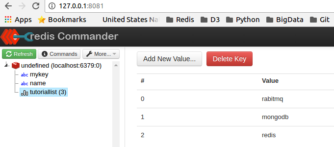

## Redis.
I have used Redis in the past, mostly as a data structures server. Recently I was also pleased to see it being used as a pub-sub mechanism. Its pretty cool the breadth of scenarios Redis is being used for.

> This post is part of the series on [Getting Started and Beyond](https://github.com/abgoswam/getting-started-and-beyond)

<!--  -->

- [Getting Started](#getting-started)
	- [What is Redis ?](#what-is-redis-)
	- [Key Capabilities.](#key-capabilities)
	- [Basic Data Types](#basic-data-types)
- [Going Beyond](#going-beyond)
	- [Advanced Features](#advanced-features)
	- [Redis GUI](#redis-gui)
- [References](#references)

## Getting Started

### What is Redis ?
Redis is an in-memory remote database that offers high performance, replication, and a unique data model to produce a platform for solving problems.

### Key Capabilities.
1. Redis holds its database entirely in memory, using the disk only for persistence.
2. Redis has a relatively rich set of data types when compared to many key-value data stores.
3. Redis can replicate data to any number of slaves.

### Basic Data Types
- Strings
- Hashes
- Lists
- Sets
- Sorted Sets

## Going Beyond

### Advanced Features
- HyperLogLog
- Pub Sub
- Transactions
- Scripting
- Connection
- Backup
- Security
- Benchmarks
- Client Connections
- Pipelining
- Partitioning

### Redis GUI
There are several Redis GUIs available, for different platforms. [This](https://redislabs.com/blog/so-youre-looking-for-the-redis-gui#.WB4o48wrJCU) article gives a good review of a few of them.

Personally I like using Redis Commander (on my ubuntu machine)

## References
- https://www.tutorialspoint.com/redis/redis_quick_guide.htm
- https://redislabs.com/blog/so-youre-looking-for-the-redis-gui#.WB4o48wrJCU
- http://blog.biasedwalk.com/2014/02/installing-redis-commander-on-ubuntu.html
- https://redislabs.com/ebook/redis-in-action/part-1-getting-started
