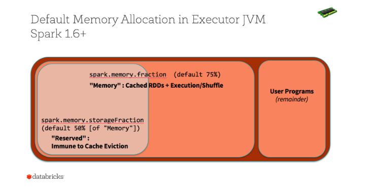

## Spark.
Spark has become the go to platform for big data processing and analysis. In this post I will try playing around with this platform.

> This post is part of the series on [Getting Started and Beyond](https://github.com/abgoswam/getting-started-and-beyond)

### What is a DataFrame?
- Schema: Modeling the data as rows, with columns
- Columns have: names, types, and nullability flag
- Does the underlying on-disk data actually have to be in row/column form? No. c.f. JSON. If you can model it as row/column, it can be loaded into a data.
- Programming model:
    -   Lazy, with a wrinkle: There’s usually a short job when you initialize the DataFrame, to determine the schema
    - Immutable
    - Table, or query, model, not a functional transformation model
        - Transformations on DataFrames build up query plan
        - So do SQL language queries against a DataFrame (they also contribute to a query plan)
        - When does the query execute? When you invoke an action.
        - What happens when you invoke an action?
            - Query plan (logical) is analyzed
            - … optimized
            - … implemented in terms of RDD types and transformations
        - Tungsten: Data read into DataFrames is stored in Tungsten binary format, which is a compact, in-memory, columnar store.
            - More efficient
                - Not garbage-collected
                - Can more easily take advantage of hardware optimizations (e.g., CPU prefetching)
            - Smaller memory footprint

### What is the overhead of caching RDDs vs. DataFrames?
- With RDDs, you are caching objects (JVM objects).
- With DataFrames, you are caching Tungsten-stored data (compact, columnar storage format).
- With tungsten the caching pressure is low, compared to RDDs.
- See Default memory Allocation in Executor JVM Spark 1.6+

### What is an RDD?
- Resilient Distributed Dataset
- Programming model
    - Lazy (also applied to DataFrames)
    - Execution deferred until we run an action (also true of DataFrames)
    - Modeled as distributed collections (a distributed iterable)
    - Immutable
    - Modeled as functional transformations
        - Higher-order functions

### RDDs all the way down
Every operation in Spark ultimately comes down to RDDs for execution.

### Notes:

- Immutability lends perfectly for parallelism
- Do not do lambdas (i.e. RDD) in Python because it would be slow.
    - The reason is because there is dependency on Cython.
    - Look up the benchmarks [here](https://www.ardentex.com/publications/RDDs-DataFrames-and-Datasets-in-Apache-Spark/#/1)
- DataSets are intermediate between DataFrame and RDD
    - If we need to drop into a lambda we need to drop down to DataSet or RDD. But as far as possible we should be in the world of DataFrame.
- Lambda works on objects
