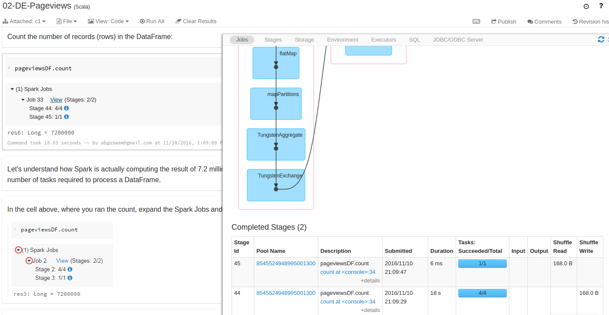

## Spark.
Spark has become the go to platform for big data processing and analysis. In this post I will try playing around with this platform.

> This post is part of the series on [Getting Started and Beyond](https://github.com/abgoswam/getting-started-and-beyond)

## Getting Started

### RDDs, DataFrames
- RDDs are like at the assembly language level.
- Most of the optimizations are at a DataFrame level.
- Master is the interface that Spark uses to interact.
- CM gets Executors. Executors are working on Drivers behalf.
- Divers have own distinct set of Executors.
- Parquet has metadata
- RRD doesnt have schema. DataFrame has schema
    - CoulmnNames with Type is what schema is. (along with whether if its nullable)
- When creating a DataFrame, Spark will run a small job to infer the schema
    - The schema is what the optimizer uses. Thats why it needs a schema. File not present on disk will throw error.
    - RRDs dont need schema.  File not present on disk doesn't throw error. With RRDs its completely lazy.
- Spark operations boils down to 2 concepts:
    - Transformations
    - Actions: Something that produces a value
        - Driver Action: e.g. collect
        - Distributed Action: e.g. save
- Executors are reading / writing. Block is unit of granularity in HDFS.
- 'count' action. Each partition will be counted separately. If the executor is done counting a specific partition, the temporary result is saved to a shuffle file.
It will communicate the resulting count back to the driver when there are no outstanding partitions to process.

### Clusters
- 'Local' mode is a simulated cluster which is just a multi-threading implementation.
- Mesos, YARN, Standalone
    - Run Spark Only : Standalone
    - Hadoop and Spark : YARN, because hadoop will be using YARN already
    - Mesos : General purpose. Runs a lot of other stuff
    - Local: Debugging and Development.
- The [Cluster Ovewrview doc](http://spark.apache.org/docs/latest/cluster-overview.html) gives a great overview of the separation of concerns between Spark and Cluster Managers.
- To further understand the difference between Driver and Master. Read [this](https://www.quora.com/What-does-the-master-node-and-driver-program-mean-in-Spark-Are-they-the-same-concept)

### Spark SQL
- We have the option to either use Spark SQL API or write base SQL.
    - Writing base SQL would require parsing

Example:
~~~
pagecountsEnAllDF
  .select($"project", $"requests")   //transformation
  .groupBy($"project")               //transformation
  .sum()                             //transformation
  .orderBy($"sum(requests)".desc)    //transformation
  .show()                            //action
~~~
is same as using the SQL api:
~~~
sqlContext.sql("SELECT project, SUM(requests) FROM x GROUP BY project ORDER BY sum(requests) DESC").show()
~~~

### Spark Internals
- Spark sends the DAG along with the lambda bytecode to the Executors.
- Stage is a scheduling boundary and is based on a shuffle boundary.

~~~
df2 = df.select($"project", $"article")
df3 = df2.filter($"project"=="en")
~~~

At this point there is no DAG. There is a query plan.

~~~
df3.collect()
~~~

### Job Execution
- 'num cores' means the number of therads being assigned to the Executor
- 'task' works on a specific partition. (also referred to as 'slots' to avoid confusion)
    - at the minimum, each partition results in a task
- The main question is  what is the right number of 'num cores' (threads)  to allocate with respect to the number of cores in the executor.
- For execution there are several optimizations done by Catalyst.
    - Logical plan
    - Optimized plan
    - Optimized Plan with Intelligent data sources. For instance filter done by data source (e.g. RDBMS via JDBC)

### Using Spark UI to analyze job execution details and performance

## Going Beyond

> Added some interesting Qquestions in a separate doc -  [QA](QA.md)

### Caching
- The unit of caching is a partition.
- Spark uses LRU.
    - So what eer does not fit into memory is spilled onto disk.
- Filling up the heap with Java Objects.
- Sometimes Spark uses the temporary shuffle files for caching.
    - This might be happening even when there is no caching going on.
    - Opportunistic caching.
- cache is shorthand for   cache() => persist(MemoryAndDisk)
    - there are a few other strategies e.g. memoryAndDisk2
- For DataFrames, Tungsten is used automatically. Tungsten stores data in columnar fashion
    - Lambdas are more of a concern if we are dealing with RDDs.

### DataSets
- A DataSet is a DataFrame thingy that lets me do lambdas.
- Type safe.
- RRDs are working on objects.
    - it would take more memory
- Fastest would be DataFrame

### Debugging
### Best Practices for architecting Spark applications
### Dealing with data skew
### Parallelism

### Spark Streaming
- Prioritized throughput over latency.
- Prior to 1.6, Streaming uses RDD Api.
- In 2.0, Streams are modeled as DataFrames.
- Batches are done in order of time.
    - "Micro batch" architecture.
- Partitioning strategy for each partition is based on blocks
- http://scala-phase.org/talks/spark-streaming-2015-09-10/#/

## References
- http://tinyurl.com/msft-spark-nov-2016
- https://spark-packages.org/
- https://www.ardentex.com/publications/RDDs-DataFrames-and-Datasets-in-Apache-Spark/#/1
- https://databricks.com/blog/2016/07/14/a-tale-of-three-apache-spark-apis-rdds-dataframes-and-datasets.html
