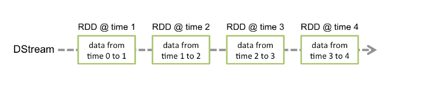
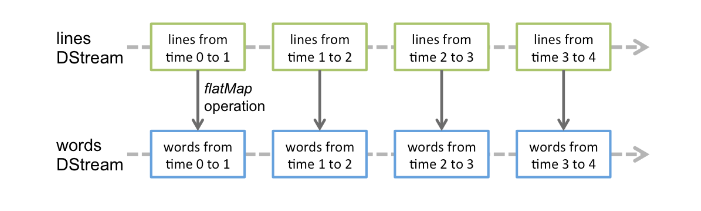

## Spark Streaming.

> This post is part of the series on [Getting Started and Beyond](https://github.com/abgoswam/getting-started-and-beyond)

### Concepts

- __Discretized Stream or DStream__ is the basic abstraction provided by Spark Streaming. It represents a continuous stream of data, either the input data stream received from source, or the processed data stream generated by transforming the input stream. Internally, a DStream is represented by a continuous series of RDDs, which is Spark’s abstraction of an immutable, distributed dataset (see Spark Programming Guide for more details). Each RDD in a DStream contains data from a certain interval, as shown in the following figure.

<!--  -->

- Any operation applied on a DStream translates to operations on the underlying RDDs. For example, in the earlier example of converting a stream of lines to words, the flatMap operation is applied on each RDD in the lines DStream to generate the RDDs of the words DStream. This is shown in the following figure.

### References
- [Spark Streaming Programming Guide](https://spark.apache.org/docs/latest/streaming-programming-guide.html)
- [Brian Clapper Spark Streaming Talk](https://newcircle.com/s/post/1763/intro-to-spark-streaming-video-tutorial)
